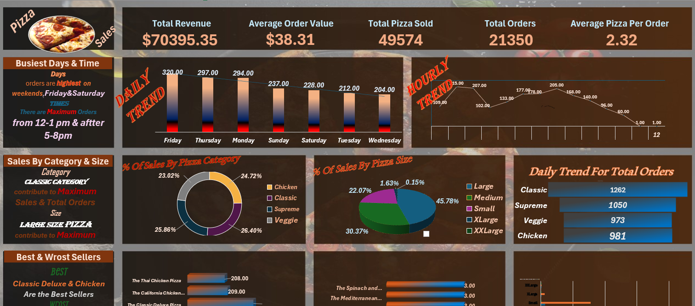

# 🍕 Pizza Sales Data Analysis Project

## 📌 Overview
This project focuses on analyzing pizza sales data to uncover key business metrics, identify purchasing trends, and evaluate top/bottom-selling products to support data-driven decisions.

---

## 📸 Dashboard Preview

---

## 🛠️ Tools & Technologies Used
* **SQL Server (T-SQL):** Data querying, aggregations, trend analysis, and performance metrics calculation.
* **Microsoft Excel:** Data modeling using **Power Pivot**, metric calculations, and interactive data visualization using **Pivot Tables**.

---

## 📊 Key Insights & Metrics
* **Total Revenue:** $71,402.75[span_0](start_span)[span_0](end_span)
* **Average Order Value:** $38.31[span_1](start_span)[span_1](end_span)
* **Total Pizzas Sold:** 49,574[span_2](start_span)[span_2](end_span)
* **Total Orders:** 21,350[span_3](start_span)[span_3](end_span)
* **Peak Days:** Friday is the busiest day with 3,538 orders, followed by Thursday and Saturday[span_4](start_span)[span_4](end_span).
* **Sales Breakdown by Category:** The Classic category generated the highest sales share (~26.9%)[span_5](start_span)[span_5](end_span).
* **Sales Breakdown by Size:** Large (L) size pizzas contributed ~45.9% to overall revenue[span_6](start_span)[span_6](end_span).
* **Best vs Worst Sellers:** Classic Deluxe & Barbecue Chicken lead in total units sold, whereas The Brie Carre had the lowest sales volume[span_7](start_span)[span_7](end_span).

---

## 📁 Repository Files
* `Pizza_Sales_Queries.sql` - Complete SQL scripts used for analysis.
* `Pizza_Sales.xlsx` - Excel workbook containing the data model, pivot tables, and visual dashboard.
* `Pizza Insights.pdf` - Query execution results and project documentation.
*
